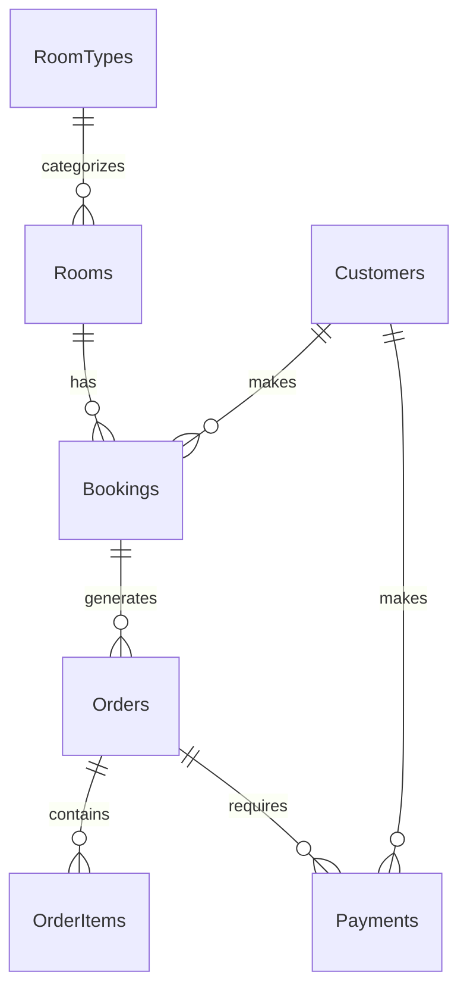

# Hotel-booking-system-# 🏨 Hotel Booking System Database

## 📝 Description
A comprehensive database system for managing hotel operations including:
- Customer management
- Room bookings
- Room service orders
- Payment processing
- Room type categorization

## 🔧 Database Structure
The system consists of the following tables:
- Customers
- RoomTypes
- Rooms
- Bookings
- Orders
- OrderItems
- Payments

## 📊 ERD (Entity Relationship Diagram)


## 🚀 Setup Instructions

1. **Prerequisites**
   - MySQL Server 5.7 or higher
   - MySQL Workbench (recommended) or any SQL client

2. **Installation**
   ```sql
   -- Run these commands in your SQL client
   CREATE DATABASE IF NOT EXISTS HotelBookingDB;
   USE HotelBookingDB;
   
   -- Then import the full SQL file
   source hotel_management_system.sql
   ```

3. **Database Features**
   - Auto-incrementing primary keys
   - Foreign key constraints for data integrity
   - ENUM types for status fields
   - Timestamp tracking for important events
   - Unique constraints where appropriate

## 🔑 Key Features
- Customer registration and management
- Room booking system
- Room service order processing
- Payment tracking
- Multiple payment methods support
- Status tracking for bookings and orders

## 📌 Notes
- All timestamps default to CURRENT_TIMESTAMP
- Prices are stored with 2 decimal places
- Phone numbers must be unique
- Email addresses must be unique